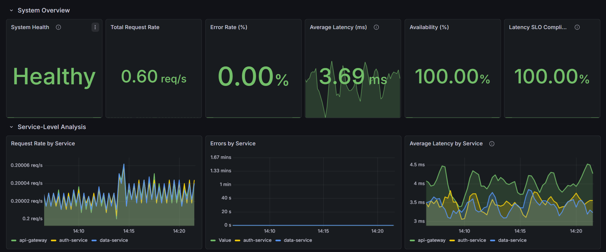

# Microservices Observability Dashboard

## Overview

This project demonstrates a production-style observability system for a microservices architecture using Prometheus and Grafana.

The system simulates real-world service interactions and visualizes system behavior under normal and failure conditions.

---

## Architecture

* API Gateway
* Auth Service
* Data Service
* Prometheus (metrics collection)
* Grafana (visualization)

Flow:

User → API Gateway → Auth Service → Data Service

---

## Dashboard Preview

### Normal Operation
<p align="center">
  
</p>

### Failure Scenario
<p align="center">
  
</p>

### Latency Distribution (p50, p95, p99)
<p align="center">
  
</p>

## Features

* Golden Signals Monitoring:

  * Traffic (Request Rate)
  * Latency (Average, p50, p95, p99)
  * Errors (Rate and breakdown)

* Service-Level Observability:

  * Latency per service
  * Errors per service
  * Request distribution

* SLO Monitoring:

  * Latency SLO compliance
  * Availability tracking

* Failure Simulation:

  * Latency spikes
  * Random service failures

---

## Tech Stack

* Python (FastAPI)
* Prometheus
* Grafana
* Docker & Docker Compose

---

## How to Run

```bash
docker-compose up --build
```

---

## Simulation

```bash
./simulate.sh
```

---

## Dashboard

Import the Grafana dashboard using:

```
monitoring/grafana/dashboard.json
```

---

## Key Insight

Even when average latency appears stable, p99 latency and SLO compliance reveal tail latency issues caused by slower services.

---

## Future Improvements

* Alerting (Grafana alerts)
* Infrastructure metrics (CPU, memory)
* Distributed tracing
